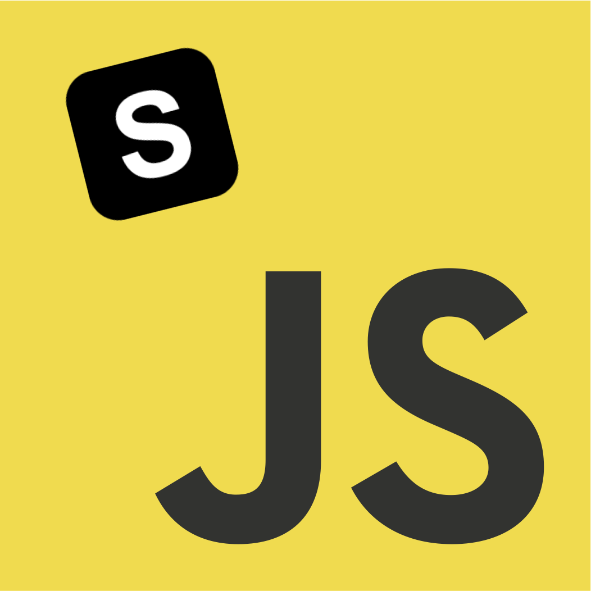

<p align="center">
  <a >
    
  </a>
</p>
<h1 align="center">Javascript Synology Api</h1>

   

📖 [中文 README](./README_zh.md)
🔎 [API Document ](https://chrissong1994.github.io/synology-api)

Synology Api Javascript wrapper can be used in Browser、CLI or Nodejs to interact with Synology NAS.
You can use domain or ip address, also supports Synology Quick Connect connect Synology server.
All apis from [https://kb.synology.cn](https://kb.synology.cn/zh-cn/search?query=API&services%5B%5D=File_Station)

## Install

```
npm install @fett/synology-api
```

## Configuration

`SynologyApi` instance parameters description

|       Parameter        |        Type         | Description                                                  | Default |
| :--------------------: | :-----------------: | :----------------------------------------------------------- | :-----: |
|         server         |       string        | Synology NAS address or QuickConnectId                       |    -    |
| quickConnectServerType | proxy \| wan \| lan | QuickConnect server type when connecting via QuickConnect ID |  proxy  |
|        username        |       string        | Synology NAS username                                        |    -    |
|        password        |       string        | Synology NAS password                                        |    -    |

You can choose to connect to the Synology server using either a **QuickConnectId** or **Synology server address**, for example:

### Connect via QuickConnectId

```js
const synologyApi = new SynologyApi({
  server: "QuickConnectId",
  quickConnectServerType: "lan", // my server is in LAN
  username: "username",
  password: "password",
});
```

### Connect via Synology server address

```js
const synologyApi = new SynologyApi({
  server: "https://192.168.1.1:5001",
  username: "username",
  password: "password",
});
```

## Use In Browser or Node.js

```bash
npm install @fett/synology-api
```

First you need to confirm that you can access across domains,for example in the React Native environment

```js
import SynologyApi from '@fett/synology-api';

const synologyApi = new SynologyApi(
  server: "https://192.168.1.1:5001", // or QuickConnectId
  username: "username",
  password: "password",
);

const info = await synologyApi.FileStation.getInfo();
```

## Use In CLI

First install the package globally

```bash
npm i -g @fett/synology-api
```

Then run cmd help message

```bash
syno --help
```

run `syno config -h` you will see the help message

```bash
Usage: synology config [options] [command]

synology api config management

Options:
  -h, --help               display help for command

Commands:
  ls                       List all the connection config
  add [options] [name]     Add connection config
  use [name]               Change current connection
  del [name]               Remove a connection
  rename <name> <newName>  Change connection name
  help [command]           display help for command
```

add a connect configuration

```bash
syno config add ConnetionName --server=https://192.168.1.1:5001 --username=admin --password=password
```

then you can use it and exec command

```bash
syno config use ConnetionName

syno fs getInfo --beautify # print file system info

```

## License

[MIT](https://github.com/ChrisSong1994/synology-api/blob/main/LICENSE)
